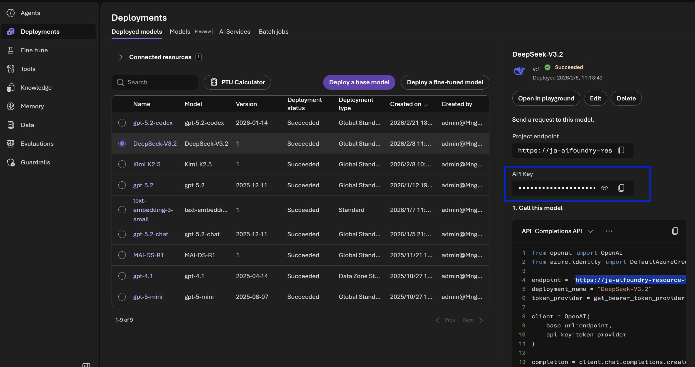
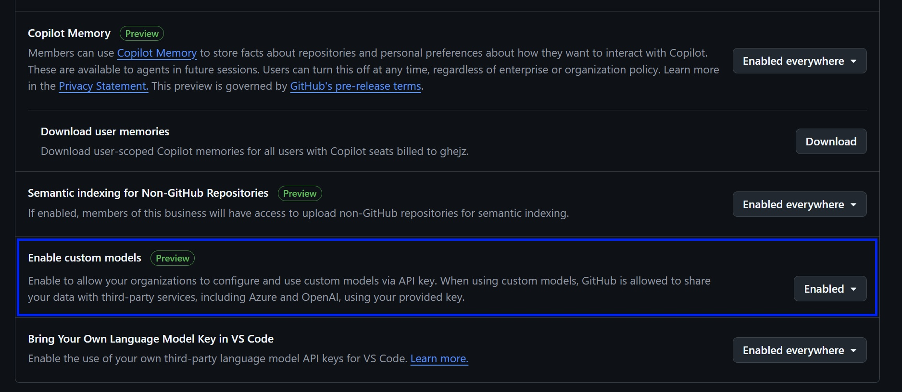
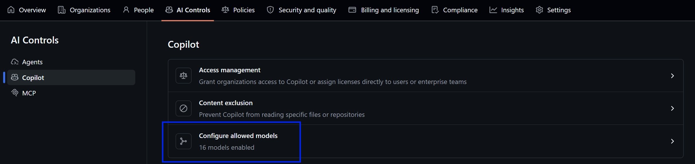
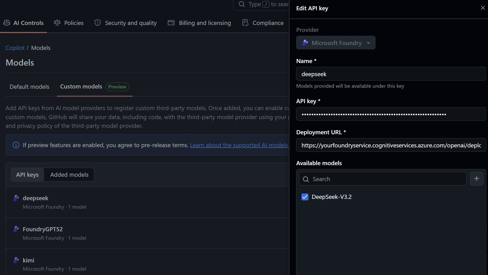
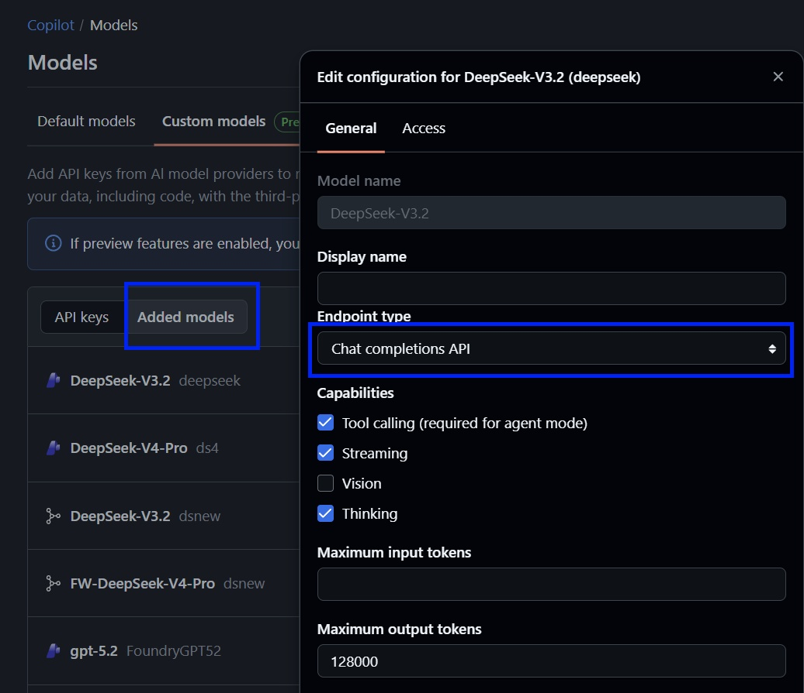
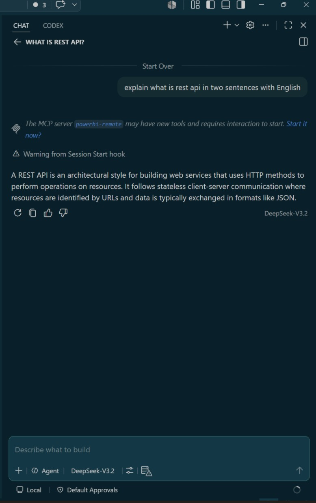
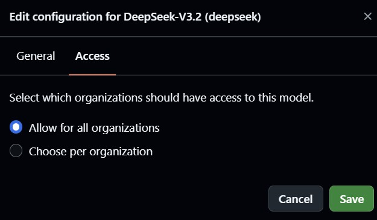

# 为 GitHub Copilot 配置 Azure Foundry 模型

GitHub Copilot 支持通过 **Bring your own API keys** 的方式，把 Microsoft Foundry 中已部署的模型添加为VS Code 可使用的自定义模型。该能力当前处于Preview，界面和字段可能会随 GitHub 后续更新调整。

本文以 Azure Foundry 中已部署的 `DeepSeek-V3.2` 为例，说明如何获取模型部署信息、在 GitHub 企业或组织中添加 Microsoft Foundry API key，并在 VS Code 中验证模型可用。

> 参考文档：GitHub Docs - [Using your LLM provider API keys with Copilot](https://docs.github.com/en/copilot/how-tos/administer-copilot/manage-for-organization/use-your-own-api-keys)

---

## 前提条件

开始前，请确认已经具备以下条件：

1. 在 Azure AI Foundry 中已经成功部署目标模型。
2. 可以在 Foundry 的模型部署页面复制 **Project endpoint** 和 **API Key**。
3. 拥有 GitHub Enterprise 或 Organization 的管理员权限，可以进入 **AI Controls** 和 Copilot 模型设置。
4. 使用该自定义模型的用户已经能够访问对应的 GitHub Enterprise 或 Organization。

---

## Step 1：在 Azure Foundry 中获取模型部署信息

进入 Azure AI Foundry 项目后，在左侧选择 **Deployments**，打开 **Deployed models** 列表，选中要接入 GitHub Copilot 的模型部署。

在右侧详情面板中，需要记录两项信息：

1. **API Key**：点击复制按钮复制该部署可用的 key。
2. **Project endpoint**：截图中 Foundry 显示的是项目 endpoint，形如：

```text
https://<foundry-service-name>.services.ai.azure.com/openai/v1
```



GitHub Copilot 在添加 Microsoft Foundry 自定义模型时，需要填写的是该部署的 **chat completions** 地址，而不是 Foundry 页面中直接显示的 `services.ai.azure.com/openai/v1` 地址。因此需要把 endpoint 转换为以下格式：

```text
https://<foundry-service-name>.cognitiveservices.azure.com/openai/deployments/<deployment-name>/chat/completions?api-version=2024-05-01-preview
```

例如，如果 Foundry 中看到的 endpoint 是：

```text
https://contoso-foundry.services.ai.azure.com/openai/v1
```

并且部署名称是：

```text
DeepSeek-V3.2
```

则在 GitHub 中填写的 **Deployment URL** 应为：

```text
https://contoso-foundry.cognitiveservices.azure.com/openai/deployments/DeepSeek-V3.2/chat/completions?api-version=2024-05-01-preview
```

## Step 2：在 GitHub 中启用自定义模型功能

进入 GitHub Enterprise 管理页面，选择顶部导航中的 **AI Controls**。在 Copilot 相关设置中找到 **Enable custom models**，将其设置为 **Enabled**。

启用后，企业或组织才可以通过 API key 添加第三方或自托管模型。



## Step 3：进入 Copilot 的模型配置页面

仍在 **AI Controls** 中，左侧选择 **Copilot**，点击 **Configure allowed models**。

该页面用于管理企业或组织允许成员使用的 Copilot 模型，包括 GitHub 默认模型和通过 API key 添加的自定义模型。



## Step 4：添加 Microsoft Foundry API key

在 **Models** 页面中，切换到 **Custom models**，点击添加或编辑 API key。

在右侧抽屉中按以下方式填写：

1. **Provider**：选择 **Microsoft Foundry**。
2. **Name**：填写一个容易识别的名称，例如 `deepseek`。该名称会用于区分这组 key 下的模型。
3. **API key**：粘贴从 Azure Foundry 部署页面复制的 API Key。
4. **Deployment URL**：填写 Step 1 中转换后的 chat completions URL：

    ```text
    https://<foundry-service-name>.cognitiveservices.azure.com/openai/deployments/<deployment-name>/chat/completions?api-version=2024-05-01-preview
    ```

5. **Available models**：输入要暴露给 Copilot 的模型 ID，然后点击加号添加模型。
6. 勾选要启用的模型后保存。



## Step 5：确认模型能力和 endpoint 类型

保存 API key 后，切换到 **Added models**，点击刚添加的模型进入配置页面。

在 **General** 页中确认以下配置：

1. **Endpoint type** 选择 **Chat completions API**。
2. 如果希望模型可用于 Agent mode，需要勾选 **Tool calling**。
3. 如果服务端支持流式返回，可以勾选 **Streaming**。
4. 如果模型支持思考或推理能力，可以按实际情况勾选 **Thinking**。
5. 根据模型和部署能力填写最大输入、输出 token。也可以设置为空。



## Step 6：在 VS Code 中验证模型可用

保存模型配置后，等待几分钟让 GitHub Copilot 的模型配置生效。然后重启 VS Code ，打开GitHub Copilot Chat，在模型选择器中查看刚添加的自定义模型，例如 `DeepSeek-V3.2`。

如果模型已经出现在模型选择器中，选择该模型并发送一条简单请求，确认模型能够正常返回结果。如果模型可用，Copilot Chat 的回答区域会显示响应内容，并在输入框附近显示当前选中的模型名称。



## Step 7：如果 VS Code 中没有模型，再配置访问范围

如果等待几分钟后，VS Code 的模型选择器中仍然看不到刚添加的模型，再回到 GitHub 的模型配置页面，切换到 **Access** 页，检查哪些组织可以使用该模型。

建议先选择 **Allow for all organizations**，允许企业内所有组织使用该模型，保存后再回到 VS Code 等待几分钟并刷新模型列表。如果企业需要更精细的权限控制，确认模型可用后可以再改为 **Choose per organization**，只开放给指定组织。

配置完成后点击 **Save**。


