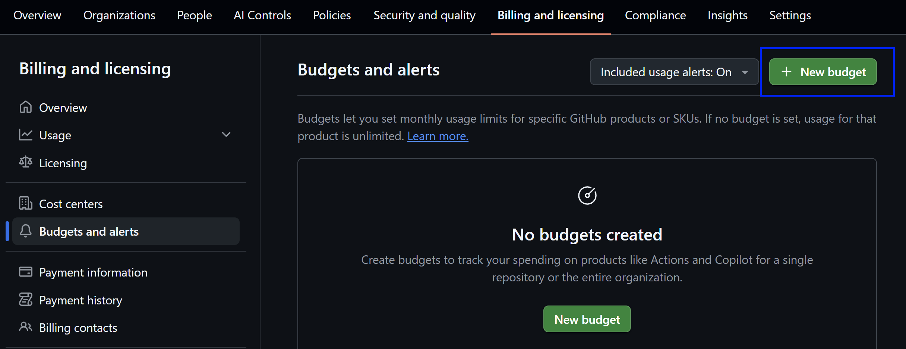
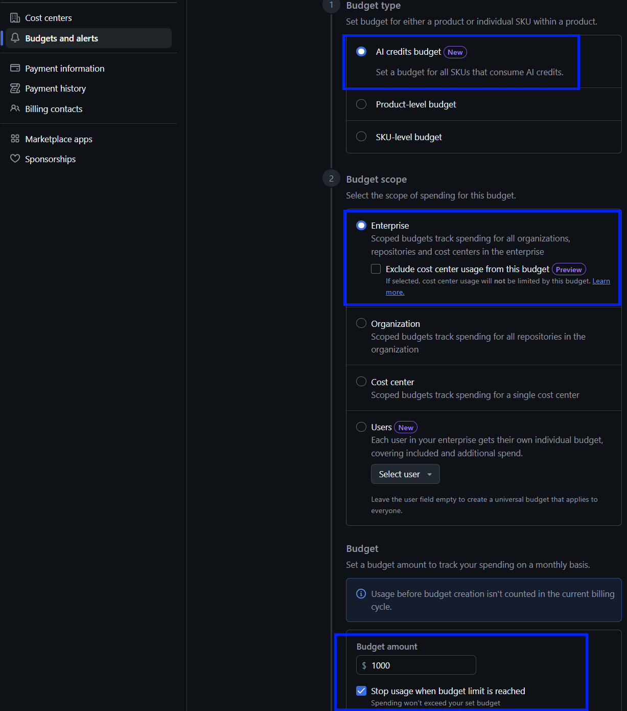
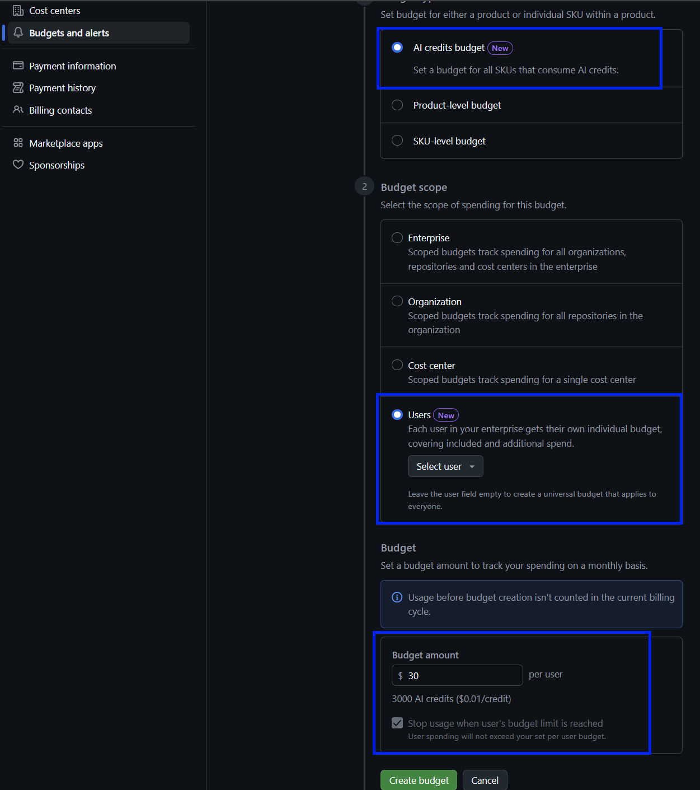
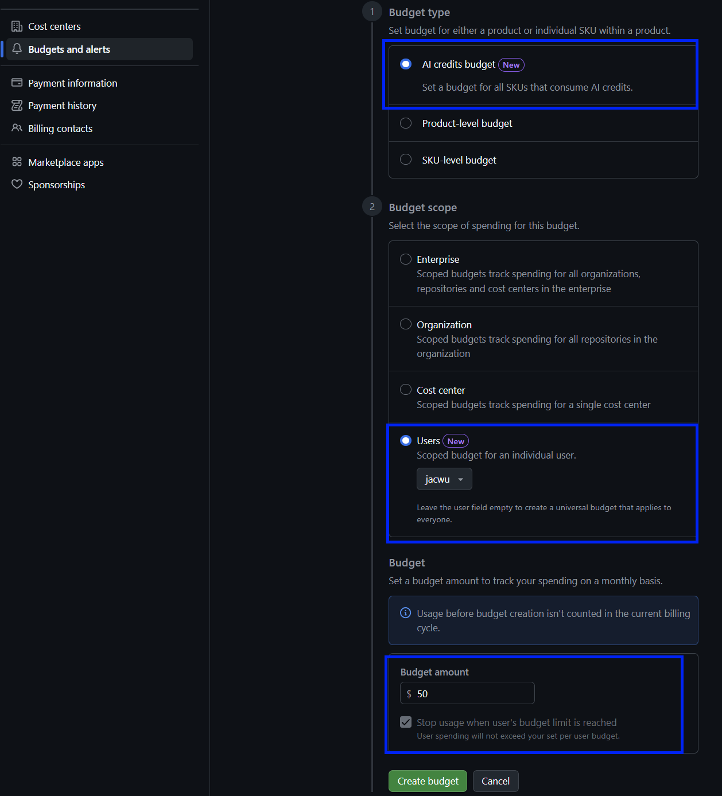

# 设置 GitHub Copilot Usage-Based Billing 预算

GitHub Copilot 将于 6 月 1 日正式切换至 **Usage-Based Billing**（基于用量计费）模式。

以下为设置预算的建议，帮助企业控制成本并避免账单超出预期：

1. 为每位用户设置合理的 ULB：Copilot Business 建议 `$19/人`，Copilot Enterprise 建议 `$39/人`。额外赠送的 Credits 可以后续再加进去。
2. 设置 Enterprise 或 Organization Budget 作为超额兜底，并务必勾选 **Stop usage when budget limit is reached**。

---

## Step 1：开始创建 budget

1. 进入 GitHub Enterprise。
2. 在顶部导航中选择 **Billing and licensing**。
3. 在左侧菜单中选择 **Budgets and alerts**。
4. 在页面右上角点击 **New budget**。

## Step 2：设置企业 budget

在创建 budget 页面，按以下方式配置企业级预算：

1. 在 **Budget type** 中选择 **AI credits budget**。
	- 该预算会覆盖所有消耗 AI Credits 的 SKU。
2. 在 **Budget scope** 中选择 **Enterprise**。
	- Enterprise scope 会跟踪企业内所有 organizations、repositories 和 cost centers 的支出。
	- 如需让 cost center 的用量不受这个预算限制，可以勾选 **Exclude cost center usage from this budget**；一般情况下建议保持不勾选，让企业预算作为统一兜底。
3. 在 **Budget amount** 中输入企业级月度预算金额。
	- 该金额用于限制 included AI Credits Pool 耗尽后的额外用量支出。
	- 可先设置一个保守金额，待观察实际使用量后再调整。
4. 勾选 **Stop usage when budget limit is reached**。
	- 这是关键设置。勾选后，当预算达到上限时，GitHub 会停止继续产生超额用量，避免账单继续增长。
5. 建议勾选"Receive budget threshold alerts"，以便在预算达到 90% 和 100% 时收到邮件通知，及时了解用量情况。
6. 检查配置无误后，进行创建。

## Step 3：设置每个用户的默认 budget

继续创建一个新的 budget，用于给每个用户设置默认的 User-Level Budget：

1. 在 **Budget type** 中选择 **AI credits budget**。
	- 该预算会覆盖所有消耗 AI Credits 的 SKU。
2. 在 **Budget scope** 中选择 **Users**。
	- Users scope 会让企业中的每个用户获得自己的独立预算。
3. **Select user** 保持留空，不选择具体用户。
	- 留空表示创建一个 universal budget，该设置会对每个用户生效。
	- 如果后续需要给某个高频用户单独设置不同预算，可以再创建针对具体用户的 budget。
4. 在 **Budget amount** 中输入每位用户的月度预算金额。
	- Copilot Business 建议设置为 `$19/人`。
	- Copilot Enterprise 建议设置为 `$39/人`。
5. 勾选 **Stop usage when user's budget limit is reached**。
	- 勾选后，当某个用户达到自己的预算上限时，不好继续产生超额费用。
6. 检查配置无误后，进行创建。

## Step 4：为具体用户设置单独 budget

如果某些用户需要更高或更低的预算，可以再创建针对具体用户的 User-Level Budget。针对具体用户的设置优先级高于 Step 3 中的 universal user budget。

1. 在 **Budget type** 中选择 **AI credits budget**。
	- 该预算会覆盖所有消耗 AI Credits 的 SKU。
2. 在 **Budget scope** 中选择 **Users**。
	- Users scope 会让预算应用到用户级别。
3. 在 **Select user** 中选择需要单独设置预算的具体用户。
	- 选择具体用户后，该 budget 只对该用户生效。
	- 该用户会优先使用这个单独 budget，而不是 Step 3 中留空用户创建的 universal budget。
4. 在 **Budget amount** 中输入该用户的月度预算金额。
	- 可以根据该用户的实际使用需求设置更高或更低的金额。
	- 例如，对高频使用者可以设置高于默认值的预算。
5. 勾选 **Stop usage when user's budget limit is reached**。
	- 勾选后，当该用户达到自己的预算上限时，不会继续产生超额用量。
6. 检查配置无误后，进行创建。

## 预算生效和计费检查顺序

当企业中的用户使用 Copilot 中会消耗 AI Credits 的功能时，GitHub 会按固定顺序检查预算控制，决定本次请求是正常服务、进入额外计费，还是被阻止。

每一次会消耗 AI Credits 的请求，会按以下顺序检查：

1. **User-level budget check**：系统首先检查用户是否已经超过自己的 User-Level Budget。
	- 如果已经超过，当前请求会被立即阻止。
	- User-Level Budget 永远是 hard stop。
	- 如果用户没有超过预算，或没有设置 ULB，请求会继续进入下一步。
2. **Shared pool check**：系统接着检查 shared pool 中是否还有 included AI Credits。
	- 如果 Pool 里还有 Credits，请求会从 shared pool 中扣减，不产生额外费用。
	- 如果 Pool 已经用完，请求会进入 metered usage，按 `$0.01 USD / AI Credit` 计费。
3. **Cost center 或 enterprise check**：对于进入 metered usage 的请求，系统会检查该用户是否被分配到 cost center。
	- 如果用户在某个 cost center 中，系统会检查该 cost center 的 budget。如果预算仍有余额，则由 cost center 支付；如果预算已用完，系统会继续检查是否启用了 **Stop usage when budget limit is reached**。
	- 如果用户不在任何 cost center 中，系统会检查 enterprise spending limit。如果限制还没有达到，则由 enterprise 支付；如果已经达到限制，系统会继续检查是否启用了 **Stop usage when budget limit is reached**。

在 cost center 和 enterprise 两种情况下，只要 **Stop usage when budget limit is reached** 已开启，达到预算上限后用户会被阻止继续产生超额用量。如果没有开启，费用会继续累计，不会自动封顶。

