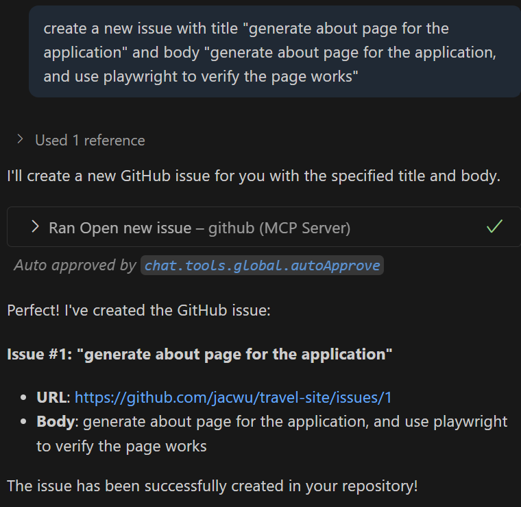

## GitHub Copilot Lab

### 什么是 MCP Server？

MCP（Model Context Protocol）Server 是一种用于为 AI（如 GitHub Copilot Chat / 其它兼容客户端）动态提供“上下文 + 工具能力”的标准化服务端组件。它的目标：让模型在对话/生成代码时，不再局限于静态提示，而是能够“按需取用”来自你本地或远程系统的：数据、文件、数据库、API、脚本执行结果、领域知识库等。

#### 核心价值
- 可扩展：一个客户端可同时连接多个不同能力的 MCP Server（例如：文件系统、数据库、日志检索、部署平台、监控告警）。
- 最小侵入：不需要改造现有系统，只需包装一个适配层即可暴露能力。
- 上下文精准：相比把大量信息“塞”进提示语，MCP 允许按需获取，减少 token 浪费并提升响应相关性。
---

### 在本 Lab 中的应用

在本实验中，我们将使用 GitHub Copilot 来：
- 创建commit message，并将代码库传到github
- 通过github mcp server获得已有issue，并创建新issue
---

## 实验环境要求

### 软件要求
- **Node.js**: >= 22.0.0
- **npm**: >= 10.0.0
- **VS Code**: 最新版本
- **GitHub Copilot**: 已登陆

---

## Lab 步骤

### 第一步：创建 PRD 文档

#### 1.1 目标
创建相关instructions文件

#### 1.2 操作步骤

1. **提交git**
   使用github copilot创建commit message，并提交本地


2. **将本地代码库提交到github**
   在vscode中将代码库提交到github
   
#### 1.3 验证
- 在github上可以看到提交的代码库


### 第二步：配置github mcp server

#### 2.1 目标
正确配置github mcp server

#### 2.2 操作步骤
1. **创建mcp.json**
   在.vscode下创建mcp.json,内容如下：
```json
{
   "servers": {
      "github": {
         "type": "http",
         "url": "https://api.githubcopilot.com/mcp/"
      }
   }
}
```

2. **启动mcp server**
   打开mcp.json文件，点击“start”，根据提示进行身份验证

3. **查看github mcp server能力工具**
   确保create_issue和list_issues工具可用
   

#### 2.3 验证
- 在github上可以看到提交的代码库

### 第三步：使用github mcp server

#### 3.1 目标
通过github mcp server查询已有issue，并创建新issue

#### 3.2 操作步骤

1. **查询已有issue**
   在 VS Code 中打开 Copilot Chat，选择Agent模式，输入以下提示词：
   ```
   which github issues do I have
   ```
   

2. **创建新issue**
   在 VS Code 中打开 Copilot Chat，选择Agent模式，输入以下提示词：
   ```
   create a new issue with title "generate about page for the application" and body "generate about page for the application, and use playwright to verify the page works"
   ```
   

3. **创建新issue**
   在 VS Code 中打开 Copilot Chat，选择Agent模式，输入以下提示词：
   ```
   create a new issue with title "generate detail page for the application" and body "generate detail page for the application. user click any destination card in home page, the application will redirect to a detail page for the destination. use playwright to verify the page works"
   ```

#### 3.3 验证
- 在github上可以看到新创建的issue

