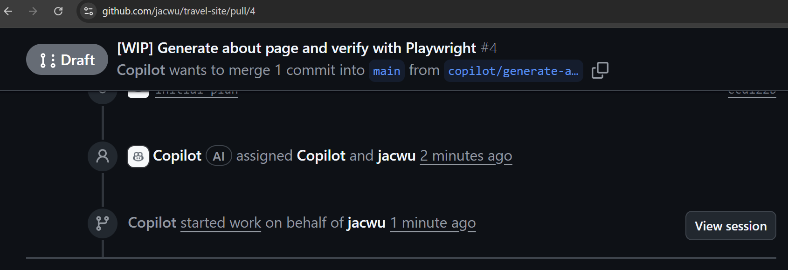

## GitHub Copilot Lab

### 什么是 Coding Agent？

Coding Agent（编码智能代理）是github上能够“理解自然语言需求 + 主动规划步骤 + 自动在代码仓库中执行具体操作”的 AI 编程执行体。它不仅生成代码片段，更像一位可托付子任务的协作型虚拟开发者。GitHub Copilot 的 *Agent 模式* 就是这种理念的实现：你给出目标，Agent 读取仓库上下文，制定行动计划，并自动完成文件创建、修改、分析、测试、提交乃至发起 Pull Request。

核心能力：
- **意图理解**：将自然语言/半结构化描述转化为可执行的开发子任务。
- **上下文感知**：读取当前仓库文件、依赖、语言规范、已有实现，避免“脱离项目现实”地生成代码。
- **产物交付**：生成补丁、提交（commit）、分支（branch）、Pull Request，形成可审阅增量。
- **可解释性**：能说明“它要做什么 / 为什么这么改 / 下一步是什么”。

### 在本 Lab 中的应用

在本实验中，我们将使用 GitHub Copilot 来：
- 使用coding agent完成在lab3中创建的两个issue

---

## 实验环境要求

### 软件要求
- **Node.js**: >= 22.0.0
- **npm**: >= 10.0.0
- **VS Code**: 最新版本
- **GitHub Copilot**: 已登陆

---

## Lab 步骤

#### 1.1 目标
使用coding agent完成在lab3中创建的两个issue

#### 1.2 操作步骤

1. **使用coding agent**
   在github中打开创建好的第一个issue，点击“Asign to copilot”按钮
   

2. **使用coding agent**
   在github中打开创建好的第二个issue，点击“Asign to copilot”按钮

3. **查看PR**
   在issue页面可以看到github copilot已经开始启动一个PR来解决issue
   

4. **查看进度**
   在issue界面，点击PR。在PR页面，点击View Session可以看到github copilot的进度。注意：coding agent处理一个issue可能需要几分钟到十几分钟的时间（取决于任务复杂度），实际使用中适合异步执行。在等待期间，开发人员可以进行其他工作。
   

5. **查看结果**
   待几分钟后，在PR页面可以看到github copilot已经完成了代码的修改，点击Files changed可以看到修改的内容。如果不满意，可以@copilot让其继续修改。
   

6. **合并PR**
   如果对修改的内容满意，可以点击Merge pull request按钮将修改合并到main分支。
   
#### 1.3 验证
- 将代码同步到本地后，可以正确运行

