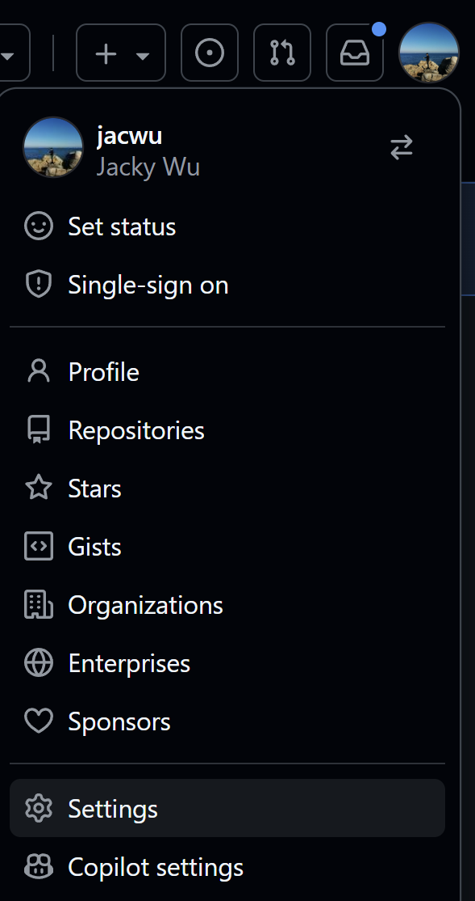
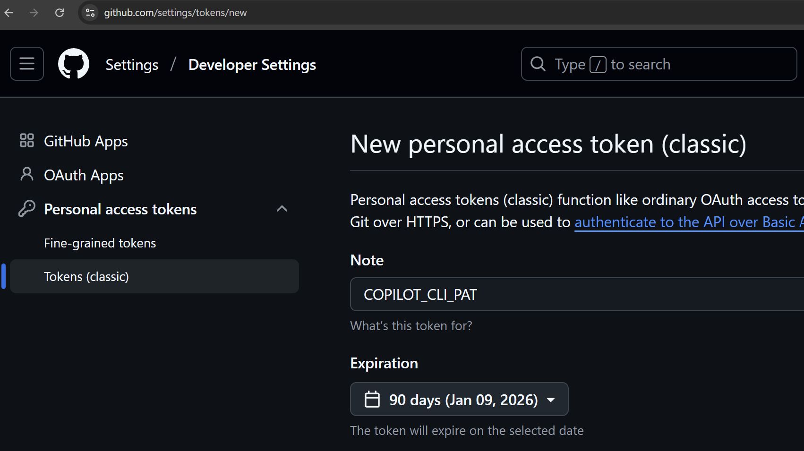
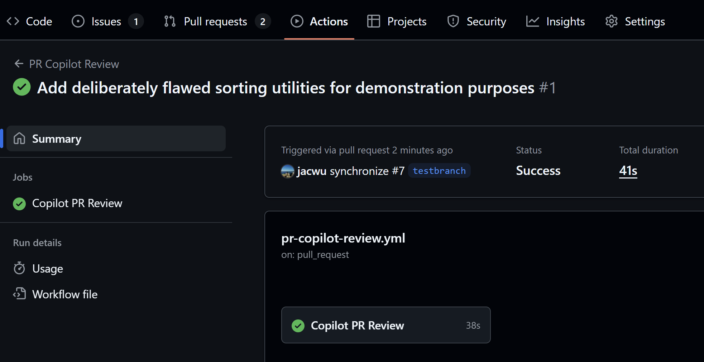
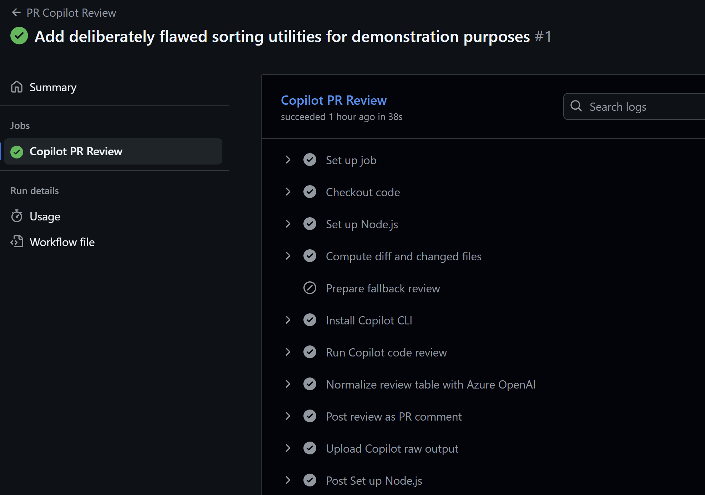
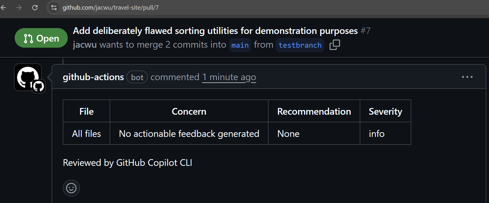

## GitHub Copilot Lab

### 为什么进行 Copilot CLI集成？

Copilot CLI 支持通过PAT（Personal Access Token）进行登陆，从而可以方便地运行在各类CI/CD环境，包括GitHub，GitLab，Jenkins和AzureDevOps等。通过进行Copilot CLI集成，可以让你在这些环境中也能享受Copilot带来的便利，大大拓展Copilot的使用场景。

### 在本 Lab 中的应用

在本实验中，我们将：
- 把Copilot CLI集成到GitHub流水线，当有新的PR时，自动触发Copilot CLI对代码进行审查
- 把Azure OpenAI集成到GitHub流水线，对Copilot CLI的分析结果进行总结，并反馈到PR
- 注意：本例仅以代码审查为例，实际可以根据需求进行更多定制化操作

## 实验环境要求

### 软件要求
- **Node.js**: >= 22.0.0
- **npm**: >= 10.0.0
- **VS Code**: 最新版本
- **GitHub Copilot**: 已登陆

---

## Lab 步骤

### 第一步：创建PAT

#### 1.1 目标
创建PAT

#### 1.2 操作步骤

1. **登陆GitHub**
    登陆GitHub，进入Settings
    

2. **创建PAT**
    选择Developer settings -> Personal access tokens -> Tokens (classic)，点击Generate new token，生成token并保存
   
   
#### 1.3 验证
- Token创建成功，并保存到本地


### 第二步：创建GitHub Secret

#### 2.1 目标
为Repository创建Secret

#### 2.2 操作步骤

1. **登陆GitHub里的目标Repository**
    登陆GitHub，进入目标Repository，进入Settings

2. **创建Secret**
    选择Secrets and variables -> Actions，点击New repository secret，依次输入以下名称和对应值。其中COPILOT_CLI_PAT为步骤一中保存的PAT
   ```
   COPILOT_CLI_PAT
   AZURE_OPENAI_API_KEY
   AZURE_OPENAI_BASE_URL
   AZURE_OPENAI_MODEL
   ```
   
   
#### 2.3 验证
- Secret创建成功

### 第三步：在GitHub Action集成Copilot CLI和Azure OpenAI

#### 3.1 目标
集成Copilot CLI和Azure OpenAI到GitHub流水线

#### 3.2 操作步骤
1. **在VS Code中打开本地仓库**
    确保仍然在feature/testbranch分支

2. **创建GitHub Actions工作流文件**
    创建.github/workflows/pr-copilot-review.yml,内容请参考https://github.com/jacwu/github-materials/blob/main/.github/workflows/pr-copilot-review.yml

3. **创建Python脚本调用Azure OpenAI**
    创建scripts/normalize_review_result.py,内容请参考https://github.com/jacwu/github-materials/blob/main/scripts/normalize_review_result.py

4. **提交代码并Push到远程**
    提交代码到本地，并push到远程仓库。本次Commit会触发第五步尚未Merge的PR。本次PR将触发GitHub Actions工作流，自动进行代码审查并反馈结果到PR

#### 3.3 验证
- 进入Actions页面，触发了GitHub Actions工作流


- 进入工作流运行详情，可以看到"Run Copilot Code Review"和"Normalize Review Table with Azure OpenAI"两个步骤均正确运行


- 回到PR页面，可以看到代码审查结果。注意：由于本次提交只有yaml和python脚本，审查可能不会发现明显代码问题。用户可以自行提交有问题的代码进一步实验
