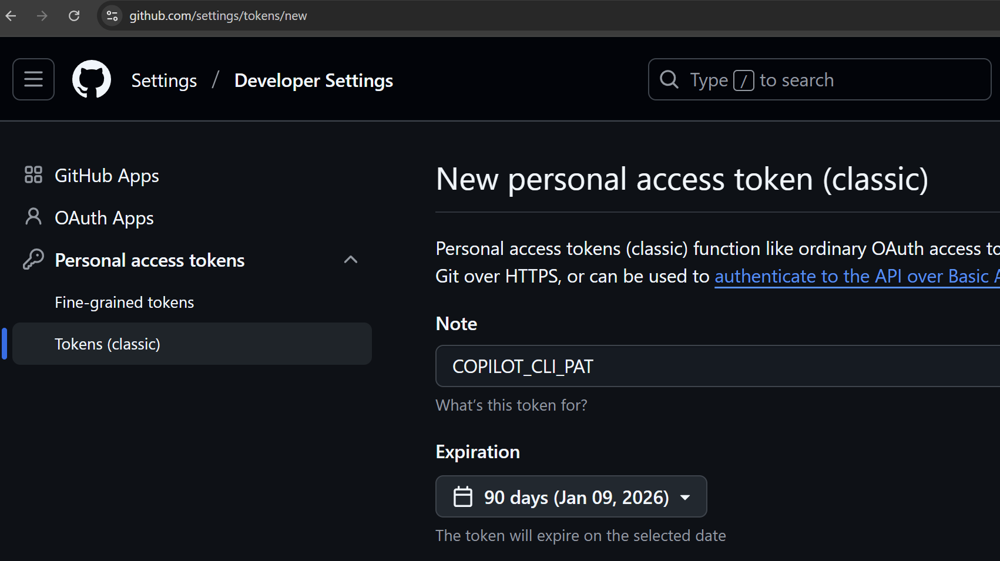

## GitHub Copilot Lab

### 什么是 Review Agent？

Review Agent（代码评审智能代理）是 GitHub Copilot 提供的自动化 Pull Request 代码审查助手。它能够读取 PR 中的差异（diff）、相关上下文文件与提交历史，结合自然语言指令，生成结构化的审查反馈。相较于传统“静态提示”工具，Review Agent 更像一位懂语义、会追问、能迭代的协作型代码 Reviewer。

核心能力：
- **差异理解**：深入解析 PR 中的变更（新增 / 修改 / 删除），识别高风险区域（安全、性能、并发、可维护性）。
- **上下文引用**：在需要时读取相关文件、依赖、函数定义，避免“只看 diff 片段”造成的误判。
- **结构化反馈**：按问题类型（Bug 风险 / 代码风格 / 复杂度 / 安全隐患 / 测试覆盖）输出清晰、可执行的建议。

### 在本 Lab 中的应用

在本实验中，我们将使用 GitHub Copilot Review Agent 来：
- 对已创建的 Pull Request 进行自动化代码审查

---

## 实验环境要求

### 软件要求
- **Node.js**: >= 22.0.0
- **npm**: >= 10.0.0
- **VS Code**: 最新版本
- **GitHub Copilot**: 已登陆

---

## Lab 步骤

### 第一步：提交有问题的代码

#### 1.1 目标
提交有问题的代码

#### 1.2 操作步骤

1. **在本地创建branch**
   ```bash
   git checkout -b feature/testbranch
   ```

2. **添加一个typescript文件**
   在 VS Code 中打开 Copilot Chat，选择Agent模式，输入以下提示词：
   ```
   使用typescript创建一个有潜在问题的排序算法，保存到sort.ts文件内
   ```

3. **提交到github**
   提交代码到本地，并push到远程仓库

#### 1.3 验证
- 在github上可以看到新创建的branch

### 第二步：在PR中进行代码审查

#### 2.1 目标
使用review agent对PR进行代码审查

#### 2.2 操作步骤
1. **创建PR并指定copilot进行代码审查**
    点击按钮"request review from copilot""并创建PR
   

2. **检查审查结果**
   稍后即可看到copilot的审查结果
   

#### 2.3 验证
- 在github上可以看到审查结果 （注意：本lab不要进行合并PR，该PR将在后续步骤继续使用）