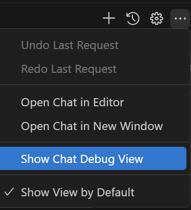

## GitHub Copilot Lab

### 什么是 GitHub Copilot？

GitHub Copilot 是由 GitHub 和 OpenAI 共同开发的 AI 编程助手，它可以：

- **智能代码补全**：根据上下文自动生成代码
- **自然语言转代码**：通过描述需求生成代码实现
- **多语言支持**：支持 Python、JavaScript、TypeScript、Go 等多种编程语言
- **学习最佳实践**：基于数十亿行开源代码训练，提供高质量代码建议

### GitHub Copilot 的优势

1. **提升开发效率**：减少重复代码编写，专注业务逻辑
2. **降低学习曲线**：帮助快速掌握新框架和技术
3. **代码质量保证**：提供符合最佳实践的代码建议
4. **上下文感知**：理解项目结构和编码风格，生成一致的代码

### 在本 Lab 中的应用

在本实验中，我们将使用 GitHub Copilot 来：
- 根据 PRD 文档生成项目结构
- 快速创建 Vue 组件和类型定义

---

## 实验环境要求

### 软件要求
- **Node.js**: >= 22.0.0
- **npm**: >= 10.0.0
- **VS Code**: 最新版本
- **GitHub Copilot**: 已登陆

---

## Lab 步骤

### 第一步：创建 PRD 文档

#### 1.1 目标
使用 GitHub Copilot 生成完整的产品需求文档（PRD）

#### 1.2 操作步骤

1. **创建项目文件夹**
   ```bash
   mkdir travel-site
   cd travel-site
   ```

2. **使用 Copilot Chat 生成 PRD**
   
   在 VS Code 中打开已创建好的文件夹travel-site，打开 Copilot Chat，选择Agent模式，输入以下提示词：
   ```
   我要创建一个旅游网站，只包含一个页面用于浏览目的地。
   请创建一份PRD并保存到一个md文件。PRD包括网站介绍，页面的功能介绍，文件目录结构和
   技术栈（html和tailwind css）。
   注意：该网站使用响应式设计，元素清晰简单，页面中所需图片尽量从Unsplash和Pexels获取，设计风格用蓝色和绿色
   ```

3. **保存 PRD**

   在Copilot Chat对话框，点击“keep”按钮，保存生成的 PRD 文档

#### 1.3 验证
- PRD文件已创建
- 文档结构清晰，包含所有必要章节

---

### 第二步：初始化Travel项目

#### 2.1 目标
初始化一个基于PRD的旅游网站项目

#### 2.2 操作步骤

1. **添加引用**

   在github copilot聊天窗口添加对已创建好的PRD文件的引用，方便后续生成代码时参考。

2. **创建项目**

   在 VS Code 中打开 Copilot Chat，选择Agent模式，输入以下提示词：
   ```
   请根据PRD的内容创建网站应用
   ```

3. **启动Debug日志**

   在VS Code Copilot Chat右上角，点击"...", 选择“Show Chat Debug View”
   

4. **打开应用**

   在 VS Code 中打开 Copilot Chat，选择Agent模式，输入以下提示词：
   ```
   在浏览器中打开主页
   ```

5. **处理错误**

   生成的项目遇到任何问题，请继续使用 Copilot Chat 进行修复，直到项目可以成功运行。
   
#### 2.3 验证
- 网站应用被成功创建
- 功能符合PRD定义
- 观察GitHub Copilot Chat的Debug日志，了解上下文是如何传递的