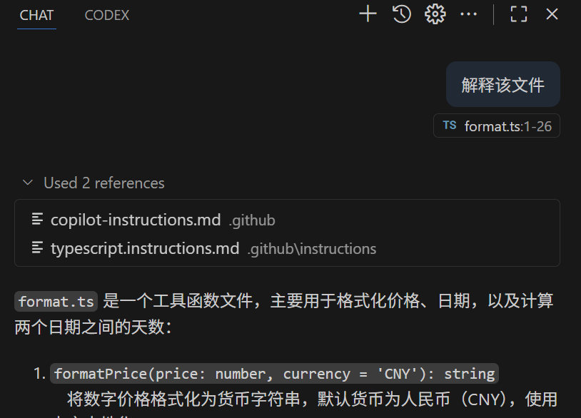

## GitHub Copilot Lab

### 什么是 Copilot 指令（Instructions）？

GitHub Copilot 的“指令”（Instructions）是一组持续生效的上下文提示，你可以把它理解为：在真正开始每一次对话或生成代码前，提前告诉 Copilot “我是谁、我偏好的风格、我当前项目的约束、请优先遵守什么规则”。它的作用是让 Copilot 自动遵循这些偏好，而不需要你每次重复说明。

核心特点：
- **持久性**：设置一次，在当前环境/会话中持续生效
- **强化一致性**：确保命名规范、框架约定、错误处理风格等统一
- **减少重复输入**：免去频繁粘贴“背景/约束/风格”描述

### 在本 Lab 中的应用

在本实验中，我们将使用 GitHub Copilot 来：
- 创建适用于所有目标代码文件的copilot-instructions.md文件
- 创建适用于typescript文件的typescript.instructions.md文件

---

## 实验环境要求

### 软件要求
- **Node.js**: >= 22.0.0
- **npm**: >= 10.0.0
- **VS Code**: 最新版本
- **GitHub Copilot**: 已登陆

---

## Lab 步骤


#### 1.1 目标
创建相关instructions文件

#### 1.2 操作步骤

1. **创建.github文件夹**
   ```bash
   mkdir .github
   cd .github
   ```

2. **创建copilot-instructions.md**
   在 VS Code 中打开 Copilot Chat，选择Agent模式，输入以下提示词：
   ```
   将PRD.md的内容创建到.github/copilot-instructions.md
   ```

3. **创建typescript.instructions.md**
   在 VS Code 中打开 Copilot Chat，选择Agent模式，输入以下提示词：
   ```
   创建.github/instructions文件夹，并创建typescript.instructions.md。内容是适合typescript的编码规范
   ```
4. **为typescript.instructions.md添加文件类型约束**
   在 VS Code 中打开 typescript.instructions.md，并在文件第一行添加如下代码：
   ```
   ---
   applyTo: '**/*.ts'
   ---
   ```

5. **解释代码**
   在vs code中关闭所有已经打开的文件，然后打开一个typescript文件，使用copilot chat解释该文件的代码逻辑，确保理解代码内容。
   ```
   解释该文件
   ```
   

6. **添加gitignore**
   在 VS Code 中打开 Copilot Chat，选择Agent模式，输入以下提示词：
   ```
   为本项目添加gitignore 文件
   ```

7. **添加settings.json**
   在项目根目录创建文件夹.vscode，添加settings.json 文件
   添加设置："github.copilot.chat.codeGeneration.useInstructionFiles": false
   格式也可参考 https://github.com/jacwu/github-materials/blob/main/.vscode/settings.json
   ```json
   {
     "github.copilot.chat.codeGeneration.useInstructionFiles": false
   }
   ```

8. **解释代码**
   使用copilot chat再次解释文件的代码逻辑。copilot-instructions.md和typescript.instructions.md不再被自动引用
   
#### 1.3 验证
- copilot-instructions.md和typescript.instructions.md都被自动引用
- 如果发现typescript.instructions.md没有被引用，请确认当前typescript文件被加入了上下文
- 通过settings.json关闭instructions文件后，instructions文件不再被引用
