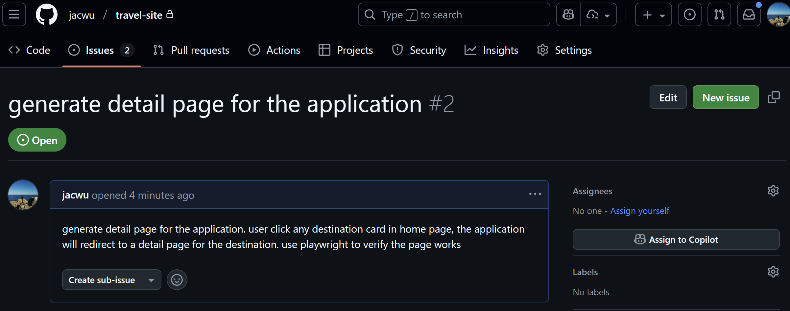

## GitHub Copilot Lab

### 什么是Prompt File？

GitHub Copilot 会通过“Prompt File”定义针对特定任务的可复用提示，从而提升开发流程的一致性与效率。这类文件通常是以 .prompt.md 作为扩展名的 Markdown 文档，并且主要在 VS Code 中获得支持。

### 在本 Lab 中的应用

在本实验中，我们将使用 GitHub Copilot 来：
- 创建可复用的 Prompt File
- 使用Prompt File对Custom Agent进行编排
---

## 实验环境要求

### 软件要求
- **Node.js**: >= 22.0.0
- **npm**: >= 10.0.0
- **VS Code**: 最新版本
- **GitHub Copilot**: 已登陆

---

## Lab 步骤

### 第一步： 创建可复用的 Prompt File

#### 1.1 目标
创建可复用的 Prompt File

#### 1.2 操作步骤

1. **创建prompts文件夹**
   ```bash
   cd .github
   mkdir prompts
   cd prompts
   ```

2. **创建form.prompt.md**

   在 prompts文件夹内创建form.prompt.md，内容如下，并保存
   ```  
    ## Goal

    Your goal is to generate a new html page with form.

    Ask for the form name and fields if not provided.

    ## Requirements

    place all the html, css and js code into a single html file.

    Use appropriate form elements: Select suitable form elements like <input>, <textarea>, <select>, etc., according to the form's purpose. For the <input> element, use the type attribute to specify its type, such as text, password, email, etc., which enables browsers to provide better input validation and user experience.

    Use the <label> tag: Add a <label> tag for each form element and associate it with the corresponding form element using the for attribute. This improves form accessibility, and users can focus on the corresponding form element when clicking the label.

    Naming of Form Elements: Use meaningful names: Give the name attribute of form elements meaningful names, which facilitates the processing of form data by server-side scripts. The names should be concise and clearly describe the purpose of the form elements.

    Form Validation: Use HTML5 validation attributes: Leverage HTML5 validation attributes such as required, minlength, maxlength, pattern, etc., to perform basic validation on form elements.

    Layout and Typography: Use the box model: Reasonably use box model properties (margin, padding, border) to control the spacing and borders of form elements, ensuring a neat and aesthetically pleasing form layout.

    Responsive design: Consider different device screen sizes and use techniques like media queries to achieve a responsive form layout, ensuring the form is properly displayed and usable on various devices.

    Style and Interaction: Consistent style: Maintain a unified style for form elements, including fonts, colors, button styles, etc., to make the form look coordinated.

   ```

3. **调用Prompt File**

   在 VS Code 中打开 Copilot Chat，选择Agent模式，输入以下提示词：
   ```
   /form Elective Course Application Form. The fields include student name, id, grade and target courses
   ```
   

   
#### 1.3 验证

- 目标html文件被创建，并符合Prompt File中的要求


### 第二步：使用Prompt File对Custom Agent进行编排


#### 2.1 目标
使用Prompt File对Custom Agent进行编排

#### 2.2 操作步骤

1. **修改Instructions文件**

   在 .github/copilot-instructions.md 文件末尾添加如下内容，并保存。这将帮助GitHub Copilot理解自定义Agent的位置
   ```
   <Custom Agent>  
      All the custom agents are in the `./.github/agents/` directory.
   </Custom Agent>
   ```

2. **创建web2outline.prompt.md**

   在 prompts文件夹内创建web2outline.prompt.md，内容如下，并保存
   ```    
   ## Steps

   1. Call custom agent web2md, save md file into folder ./articles
   2. Call custom agent ouline, save md file into folder ./articles
   ```

3. **调用Prompt File**

   在 VS Code 中打开 Copilot Chat，选择Agent模式，输入以下提示词：
   ```
   /web2outline https://code.visualstudio.com/blogs/2024/11/15/introducing-github-copilot-for-azure
   ```
   

   
#### 2.3 验证
- 两个md文件被创建到目标文件夹，数据源来自于对应网址


