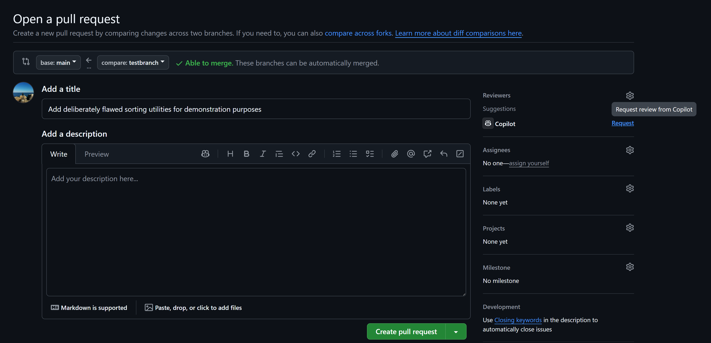
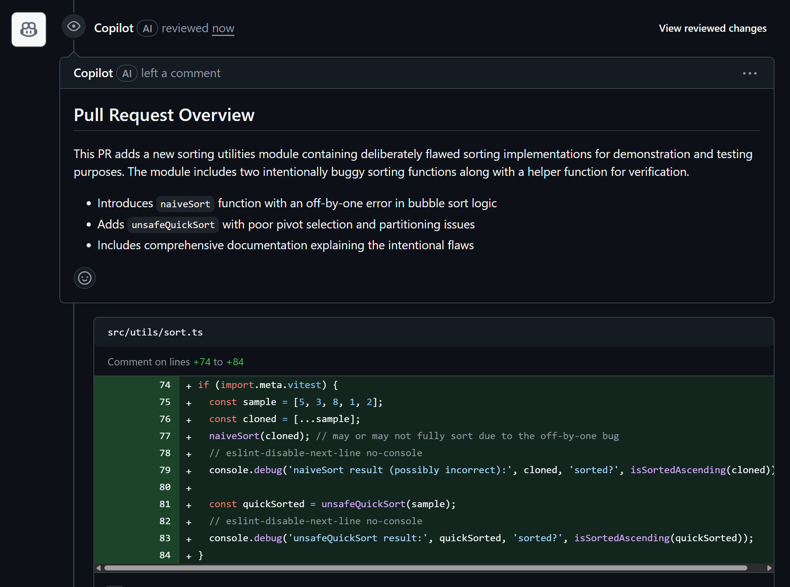

## GitHub Copilot Lab

### 什么是 网页版Copilot Chat？

Copilot Chat网页版在 GitHub.com 上，可从仓库、拉取请求、议题、讨论和知识库等入口访问；它会根据你打开聊天时所处的具体上下文定制回答。


### 在本 Lab 中的应用
在本实验中，我们将在github.com访问已创建的代码库，并使用copilot进行问答

---

## 实验环境要求

### 软件要求
- **Node.js**: >= 22.0.0
- **npm**: >= 10.0.0
- **VS Code**: 最新版本
- **GitHub Copilot**: 已登陆

---

## Lab 步骤


#### 1.1 目标
使用网页版 Copilot Chat

#### 1.2 操作步骤

1. **登陆代码库**
   登陆github.com，打开之前创建的代码库

2. **进入Copilot Chat**
   点击“Chat with Copilot”按钮，进入Copilot Chat界面
   

3. **查询Issue**
   在 Copilot Chat 中输入以下提示词并执行
   ```
   list all the issues and summarize
   ```
   

4. **创建Issue**
   在 Copilot Chat 中输入以下提示词并执行
   ```
   /create-issue Add a “My Orders" page when users can look up their historical order list
   ```
   

5. **确认创建Issue**
   Review待创建的Issue内容，点击“Create”按钮确认创建
   
   
#### 1.3 验证
- Issue被成功查询并创建


