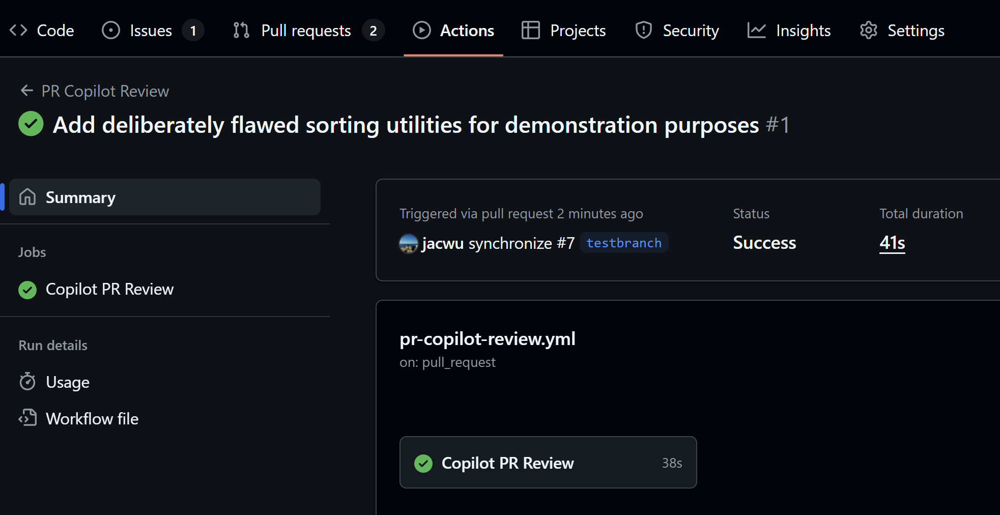
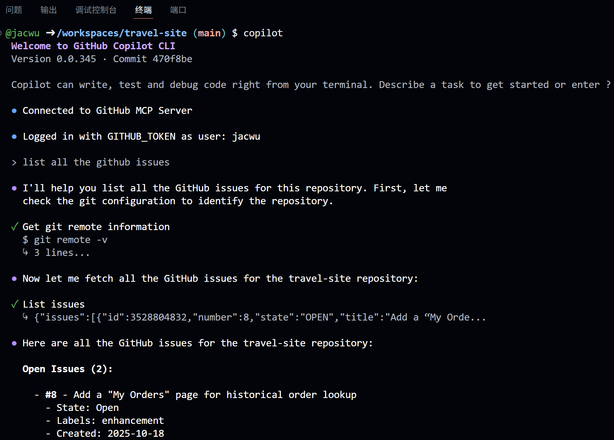
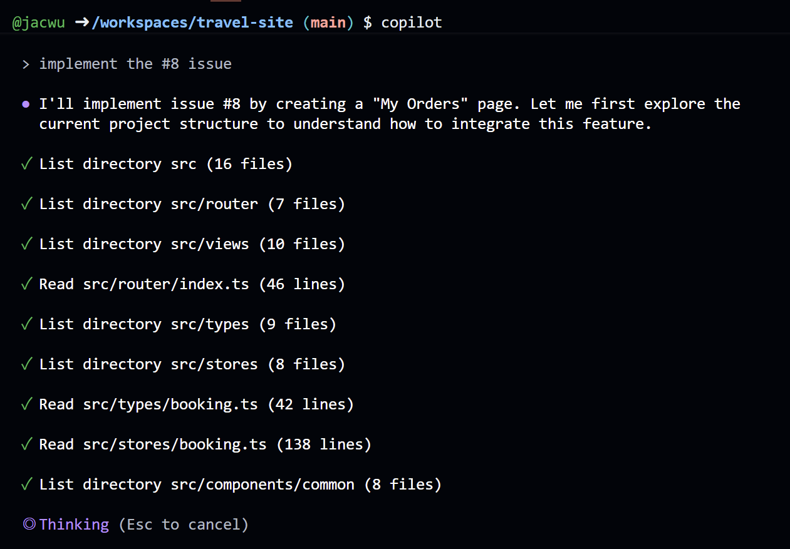
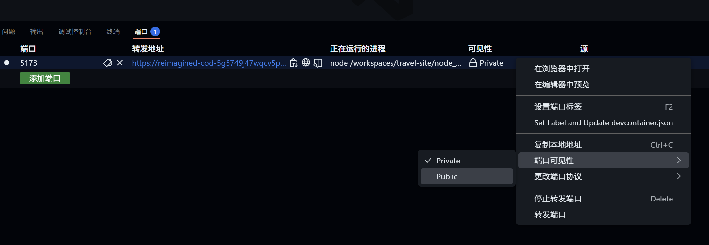

## GitHub Copilot Lab

### 什么是GitHub CodeSpace？

GitHub CodeSpace 是一个在线开发环境，允许开发者在浏览器中直接编辑和运行代码。它提供了一个完整的 VS Code 编辑器体验，并集成了 GitHub 的功能，使得协作和版本控制变得更加高效。

### 在本 Lab 中的应用

在本实验中，我们将：
- 使用 GitHub CodeSpace 创建一个新的开发环境
- 了解如何在 CodeSpace 中使用 GitHub Copilot
- 在 CodeSpace 中使用Copilot CLI
---

## 实验环境要求

### 软件要求
- **Node.js**: >= 22.0.0
- **npm**: >= 10.0.0
- **VS Code**: 最新版本
- **GitHub Copilot**: 已登陆

---

## Lab 步骤

### 第一步： 启动 GitHub CodeSpace

#### 1.1 目标
启动 GitHub CodeSpace 并使用GitHub Copilot

#### 1.2 操作步骤

1. **在 GitHub 仓库页面打开 Codespaces 创建入口**
   - 在github.com访问已创建的仓库，点击右上角的绿色 `Code` 按钮。
   - 切换到弹出窗口中的 `Codespaces` 选项卡，对应截图中绿色按钮与右侧选项卡的界面。
   - 点击 `Create codespace on main`，等待 GitHub 在云端初始化开发环境。
   

2. **使用 GitHub Copilot**
   - 初始化完成后浏览器会自动打开 VS Code Web，该环境已自动登陆GitHub Copilot。
   - 在 VS Code 中打开 Copilot Chat，选择Agent模式，输入以下提示词。可以看到Copilot已经可以正常工作：
   ```
   explain the project
   ```
   

   
#### 1.3 验证
- 浏览器成功跳转到 VS Code Web 环境，并可正常使用GitHub Copilot


### 第二步：在CodeSpace使用Copilot CLI


#### 2.1 目标
在CodeSpace使用Copilot CLI

#### 2.2 操作步骤

1. **安装 Copilot CLI**
   - 在终端中执行以下命令，全局安装 Copilot CLI：
   ```bash
   npm install -g @github/copilot
   ```
   

2. **启动 Copilot CLI 并确认连接**
   - 输入 `copilot` 命令，CLI 会自动连接 GitHub MCP Server 并完成身份确认。
   - 在对话提示符中输入 `list all the github issues`，让 Copilot 收集仓库中的 issue 列表。
   

3. **让 Copilot CLI 分析并实施指定 Issue**
   - 在 CLI 中继续输入 `implement the #8 issue`。注意：选择第五个实验创建的Issue，并用实际的Issue编号替换`#8`。
   - 等待 Copilot 完成代码修改指导或自动编辑。
   

4. **启动开发服务器验证改动**
   - 在任务完成后返回终端，运行开发命令：
   ```bash
   npm run dev
   ```
   - Copilot 会在后台检查服务是否成功启动。
   

5. **在 Codespaces 中公开端口访问**
   - 打开 Codespaces 的 `Ports` 面板，将端口的可见性切换为 `Public`，以便从浏览器访问站点。
   

6. **通过公开地址访问站点**
   - 在浏览器中打开 Copilot 提供的转发链接，访问网站。
   

   
#### 2.3 验证
- Copilot CLI 成功完成 issue 处理，开发服务器可在公开端口访问并显示最新页面
- CodeSpace 默认将在无操作 30 分钟后自动关闭
- 再次启动 CodeSpace 时，之前的改动保留


