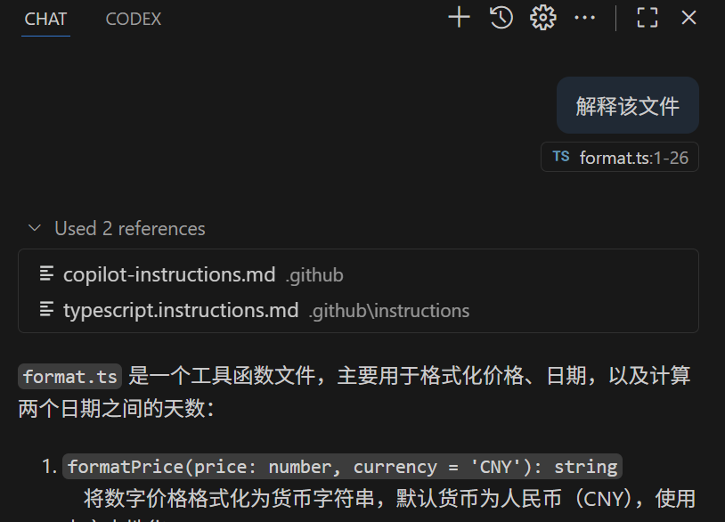

## GitHub Copilot Lab

### What Are Copilot Instructions?

Copilot "instructions" are persistent context hints that run before every chat or code-generation request. Think of them as telling Copilot who you are, what style you prefer, the constraints of your current project, and which rules to prioritize—so you do not have to repeat those details in each conversation.

Key traits:
- **Persistent**: configure once and they stay active for the current environment or session.
- **Consistent**: enforce naming conventions, framework agreements, and error-handling patterns.
- **Low repetition**: avoid pasting the same background, constraints, or style guidance over and over.

### How We'll Use Them in This Lab

In this lab we will use GitHub Copilot to:
- Create `copilot-instructions.md` that applies to all code files.
- Create `typescript.instructions.md` that applies to TypeScript files only.

---

## Lab Environment

### Software Requirements
- **Node.js**: >= 22.0.0
- **npm**: >= 10.0.0
- **VS Code**: latest version
- **GitHub Copilot**: signed in

---

## Lab Steps

#### 1.1 Goal
Create the instruction files.

#### 1.2 Procedure

1. **Create the `.github` folder**
   ```bash
   mkdir .github
   cd .github
   ```

2. **Create `copilot-instructions.md`**
   In VS Code, open Copilot Chat, switch to Agent mode, and run:
   ```
   Copy the content of PRD.md into .github/copilot-instructions.md.
   ```

3. **Create `typescript.instructions.md`**
   Still in Agent mode, run:
   ```
   Create the .github/instructions folder and add typescript.instructions.md with TypeScript coding conventions.
   ```

4. **Add the file-type constraint**
   Open `typescript.instructions.md` and insert at the top:
   ```
   ---
   applyTo: '**/*.ts'
   ---
   ```

5. **Ask Copilot to explain a TypeScript file**
   Close open editors, open any TypeScript file, and prompt Copilot Chat:
   ```
   Explain this file.
   ```
   

6. **Add `.gitignore`**
   In Copilot Chat (Agent mode) run:
   ```
   Generate a .gitignore for this project.
   ```

7. **Add `settings.json`**
   Create the `.vscode` folder and add `settings.json` with the setting `"github.copilot.chat.codeGeneration.useInstructionFiles": false`. Use the repo’s existing file as a reference if needed.
   ```json
   {
     "github.copilot.chat.codeGeneration.useInstructionFiles": false
   }
   ```

8. **Explain the code again**
   Have Copilot Chat explain the same TypeScript file. The instruction files will no longer be referenced automatically.

#### 1.3 Validation
- `copilot-instructions.md` and `typescript.instructions.md` are both referenced automatically.
- If `typescript.instructions.md` is not referenced, make sure the TypeScript file is included in context.
- After disabling instruction files in `settings.json`, they are no longer referenced automatically.
