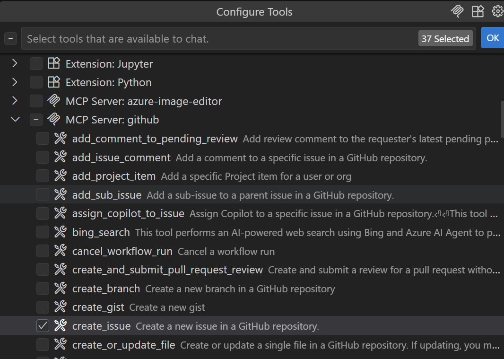

## GitHub Copilot Lab

### What Is a Custom SubAgent?

A custom SubAgent is defined by a set of instructions and tools that become active whenever you switch to that mode. For example, a mode named "Plan" can include instructions for building an implementation plan and only enable read-only tools. By creating custom modes you can quickly swap to a specific configuration without manually picking tools and instructions each time. A custom SubAgent is declared in a Markdown file with the `.agent.md` extension, which can live in the workspace for team sharing or in personal settings for reuse across projects.

### How It's Used in This Lab

In this lab we will use GitHub Copilot to:
- Create reusable custom SubAgents
---

## Lab Environment Requirements

### Software Requirements
- **Node.js**: >= 22.0.0
- **npm**: >= 10.0.0
- **VS Code**: Latest version
- **GitHub Copilot**: Signed in

---

## Lab Steps

### Step 1: Create a Reusable Custom SubAgent

#### 1.1 Goal
Create a reusable custom SubAgent.

#### 1.2 Steps

1. **Create the .github folder**
   ```bash
   cd .github
   mkdir agents
   cd agents
   ```

2. **Create `web2md.agent.md`**
   Inside the `agents` folder create `web2md.agent.md` with the following content and save it.
   ```
   ---
   description: 'You are an assistant that converts web page content into local Markdown files. You extract textual content from web pages and format it into structured Markdown documents.'
   tools: ['edit/createFile', 'edit/createDirectory', 'fetch', 'todos']
   model: GPT-5-Codex (Preview)
   ---
   ## Overview
   The user will provide a web page link and a local folder path. The link points to detailed information about a certain topic. The user will also provide a local folder path indicating where you should save the converted Markdown file.

   ## Steps
   1. Use the web fetch tool to retrieve the web page content. Don't use any mcp tools.
   2. Extract the text content from the web page.
   3. Convert the extracted content into structured Markdown format with the following requirements:
      - Keep the Markdown language type consistent with the web page.
      - Keep the content identical to the source without any modifications.
      - Convert headings, subheadings, lists, code blocks, etc. from the web page into their Markdown equivalents.
      - Exclude metadata or footer sections unrelated to the actual content, such as "Tags", "Written by", "Related posts", etc.
   4. Add two sections at the beginning of the Markdown file, one for the source web page link and one for a summary, both using Markdown heading formatting.
   5. Use the createDirectory tool to create the local folder if it does not exist.
   6. Use the createFile tool to save the Markdown content to the specified local folder. Requirements:
      - Name the file after the topic of the web page.
      - Use the .md file extension.
      - Save the file to the local folder path provided by the user.
      - Do not modify any existing files.
   ```

3. **Invoke the custom SubAgent**
   Open Copilot Chat in VS Code, select the `web2md` mode, and enter the following prompt:
   ```
   https://code.visualstudio.com/docs/copilot/customization/custom-chat-modes folder: articles
   ```
   

#### 1.3 Validation
- The target Markdown file is created in the target folder using data sourced from the corresponding URL.


### Step 2: Create Another Reusable Custom SubAgent

#### 2.1 Goal
Create a reusable custom SubAgent.

#### 2.2 Steps

1. **Create `outline.agent.md`**
   Inside the `agents` folder create `outline.agent.md` with the following content and save it.
   ```
   ---
   description: 'You analyze selected Markdown and produce an English PowerPoint outline with 6-8 high-level slides.'
   tools: ['edit/createFile', 'edit/createDirectory', 'todos']
   model: GPT-5-Codex (Preview)
   ---
   ## Overview
   Transform Markdown supplied into an English PowerPoint outline with 6-8 high-level slides that stay faithful to the original content.

   ## Steps
   1. Review the target markdown file content.
   2. Identify the major sections and supporting details directly from the Markdown without inventing new information.
   3. Plan 6-8 slide titles that reflect the document structure and keep the narrative flow clear.
   4. For each slide, draft 3-4 bullet points sourced verbatim or paraphrased from the Markdown while preserving the original meaning.
   5. Return the outline in a clean, presentation-ready format for the user.
   ```

2. **Invoke the custom SubAgent**
   Open Copilot Chat in VS Code, select the `outline` mode, add the Markdown file generated in Step 1 to the context, and enter the following prompt:
   ```
   execute
   ```
   

3. **Clean up files**
   Delete the Markdown file generated in Step 1 inside VS Code.

#### 2.3 Validation
- The outline output meets expectations.
