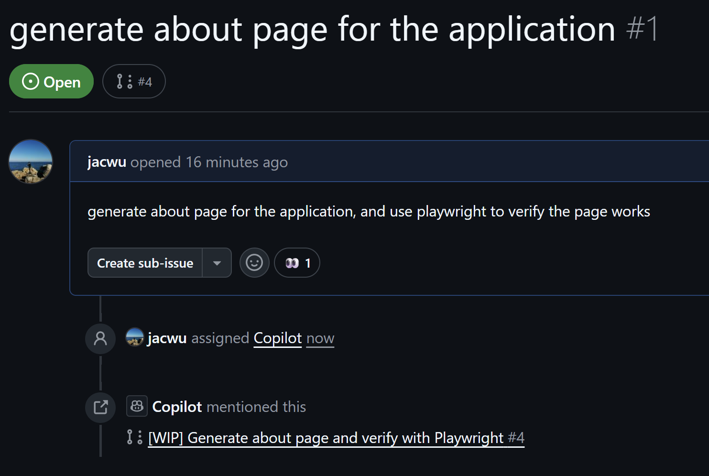

## GitHub Copilot Lab

### What Is a Prompt File?

GitHub Copilot can define reusable prompts for specific tasks through "Prompt Files", improving the consistency and efficiency of development workflows. These files usually use the `.prompt.md` extension and are primarily supported in VS Code.

### How It's Used in This Lab

In this lab we will use GitHub Copilot to:
- Create reusable Prompt Files
- Orchestrate SubAgents with a Prompt File
---

## Lab Environment Requirements

### Software Requirements
- **Node.js**: >= 22.0.0
- **npm**: >= 10.0.0
- **VS Code**: Latest version
- **GitHub Copilot**: Signed in

---

## Lab Steps

### Step 1: Create a Reusable Prompt File

#### 1.1 Goal
Create a reusable Prompt File.

#### 1.2 Steps

1. **Create the .github folder**
   ```bash
   cd .github
   mkdir prompts
   cd prompts
   ```

2. **Create `form.prompt.md`**
   Inside the `prompts` folder create `form.prompt.md` with the following content and save it.
   ```  
    ## Goal

    Your goal is to generate a new html page with form.

    Ask for the form name and fields if not provided.

    ## Requirements

    place all the html, css and js code into a single html file.

    Use appropriate form elements: Select suitable form elements like <input>, <textarea>, <select>, etc., according to the form's purpose. For the <input> element, use the type attribute to specify its type, such as text, password, email, etc., which enables browsers to provide better input validation and user experience.

    Use the <label> tag: Add a <label> tag for each form element and associate it with the corresponding form element using the for attribute. This improves form accessibility, and users can focus on the corresponding form element when clicking the label.

    Naming of Form Elements: Use meaningful names: Give the name attribute of form elements meaningful names, which facilitates the processing of form data by server-side scripts. The names should be concise and clearly describe the purpose of the form elements.
    html

    Form Validation: Use HTML5 validation attributes: Leverage HTML5 validation attributes such as required, minlength, maxlength, pattern, etc., to perform basic validation on form elements.

    Layout and Typography: Use the box model: Reasonably use box model properties (margin, padding, border) to control the spacing and borders of form elements, ensuring a neat and aesthetically pleasing form layout.

    Responsive design: Consider different device screen sizes and use techniques like media queries to achieve a responsive form layout, ensuring the form is properly displayed and usable on various devices.

    Style and Interaction: Consistent style: Maintain a unified style for form elements, including fonts, colors, button styles, etc., to make the form look coordinated.

   ```

3. **Invoke the Prompt File**
   Open Copilot Chat in VS Code, switch to Agent mode, and enter the following prompt:
   ```
   /form Elective Course Application Form. The fields include student name, id, grade and target courses
   ```
   

#### 1.3 Validation
- The target HTML file is created and satisfies the requirements defined in the Prompt File.


### Step 2: Orchestrate SubAgents with a Prompt File

#### 2.1 Goal
Orchestrate SubAgents with a Prompt File.

#### 2.2 Steps

1. **Create `web2outline.prompt.md`**
   Inside the `prompts` folder create `web2outline.prompt.md` with the following content and save it.
   ```
   ## Goal
   Your goal is to generate an outline for a PowerPoint presentation based on the content of a given webpage.

   ## Steps
   1. **Webpage Fetch**: Call web2md agent defined in agents foler, save md file into articles folder.
   2. **Outline Creation**: Call outline agent defined in agents folder, save md file into articles folder.
   ```

3. **Invoke the Prompt File**
   Open Copilot Chat in VS Code, switch to Agent mode, and enter the following prompt:
   ```
   /web2outline https://code.visualstudio.com/docs/copilot/customization/custom-chat-modes
   ```
   

#### 2.3 Validation
- Two Markdown files are created in the target folder with content sourced from the corresponding URL.
