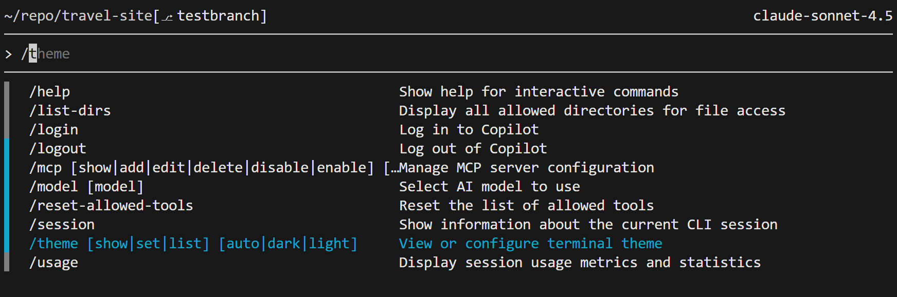

## GitHub Copilot Lab

### What Is the Coding Agent?

The Coding Agent is an AI execution agent on GitHub that understands natural-language requirements, plans the steps, and performs concrete actions inside a repository. Instead of only generating snippets, it acts like a collaborative developer you can delegate tasks to. GitHub Copilot’s *Agent mode* embodies this idea: you specify a goal, the agent reads the repository, creates an action plan, and can automatically modify files, run tests, commit changes, and even open pull requests.

Key capabilities:
- **Intent understanding**: turn natural-language or semi-structured descriptions into actionable subtasks.
- **Context awareness**: inspect files, dependencies, conventions, and existing implementations to keep changes grounded in the project.
- **Deliverables**: produce patches, commits, branches, and pull requests as reviewable increments.
- **Explainability**: summarize what it plans to do, why, and what comes next.

### How We'll Use It in This Lab

We will ask GitHub Copilot to:
- Resolve the two issues created in Lab 3 using the coding agent.

---

## Lab Environment

### Software Requirements
- **Node.js**: >= 22.0.0
- **npm**: >= 10.0.0
- **VS Code**: latest version
- **GitHub Copilot**: signed in

---

## Lab Steps

#### 1.1 Goal
Use the coding agent to complete the two issues created in Lab 3.

#### 1.2 Procedure

1. **Assign the first issue to Copilot**
   On GitHub, open the first issue and click **Assign to Copilot**.
   

2. **Assign the second issue**
   Repeat the process for the second issue.

3. **Review the pull request**
   On the issue page, Copilot will spin up a pull request to address the issue.
   

4. **Monitor progress**
   From the issue page, open the pull request and click **View session** to see Copilot’s progress. Note: depending on complexity, the agent may take several minutes. You can work on other tasks while it runs.
   

5. **Review the changes**
   After a few minutes, check the **Files changed** tab to inspect the modifications. If something needs adjustment, @mention Copilot for further changes.
   

6. **Merge the pull request**
   Once satisfied, click **Merge pull request** to merge into `main`.

#### 1.3 Validation
- After syncing the latest code locally, the project runs correctly.

