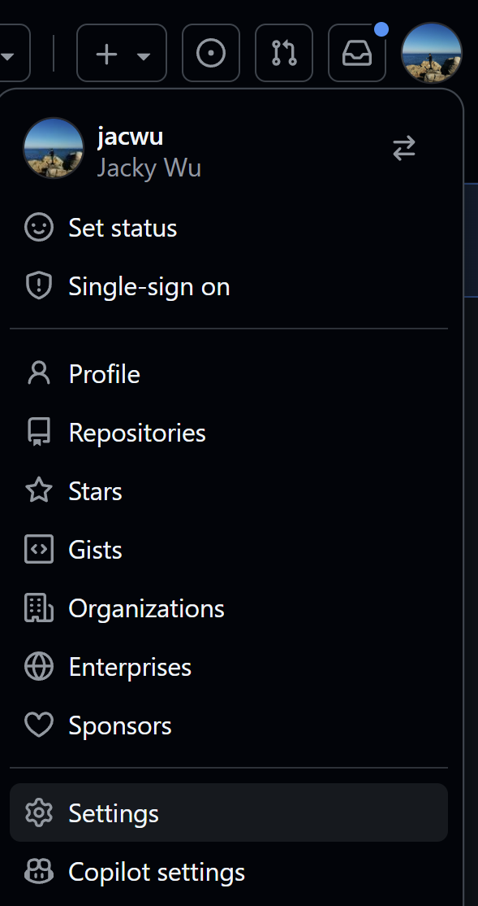

## GitHub Copilot Lab

### What Is the Review Agent?

The Review Agent is GitHub Copilot’s automated pull request reviewer. It reads the diff, relevant files, and commit history, combines that context with your instructions, and generates structured feedback. Compared with static linting, the Review Agent behaves more like a collaborative reviewer who understands semantics, asks follow-up questions, and iterates.

Key capabilities:
- **Diff comprehension**: analyze additions, modifications, and deletions to spot risky areas (security, performance, concurrency, maintainability).
- **Context retrieval**: pull in related files, dependencies, and definitions when needed so it doesn’t judge changes in isolation.
- **Structured feedback**: flag bugs, style problems, complexity concerns, security risks, and testing gaps with actionable guidance.

### How We'll Use It in This Lab

We will use GitHub Copilot Review Agent to:
- Automatically review an existing pull request.

---

## Lab Environment

### Software Requirements
- **Node.js**: >= 22.0.0
- **npm**: >= 10.0.0
- **VS Code**: latest version
- **GitHub Copilot**: signed in

---

## Lab Steps

### Step 1: Commit Code with Issues

#### 1.1 Goal
Commit code that contains issues.

#### 1.2 Procedure

1. **Create a branch locally**
   ```bash
   git checkout -b feature/testbranch
   ```

2. **Add a problematic TypeScript file**
   In Copilot Chat (Agent mode) run:
   ```
   Create a TypeScript sorting algorithm with potential issues and save it to sort.ts.
   ```

3. **Push to GitHub**
   Commit the changes locally and push the branch to the remote repository.

#### 1.3 Validation
- The new branch appears on GitHub.

### Step 2: Run the Review Agent on the PR

#### 2.1 Goal
Use the Review Agent to evaluate the pull request.

#### 2.2 Procedure
1. **Open a PR and request Copilot’s review**
   Click **request review from Copilot** while creating the PR.
   

2. **Inspect the review results**
   After a short while, Copilot’s review feedback will appear.
   

#### 2.3 Validation
- The review results are visible on GitHub. (Do not merge this PR yet; later labs will continue using it.)