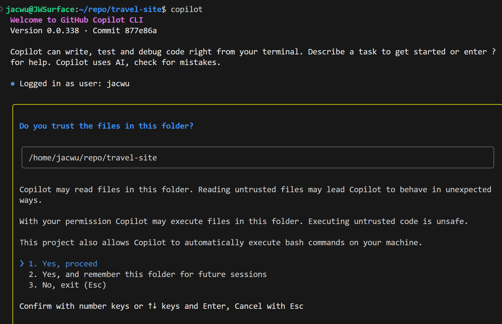
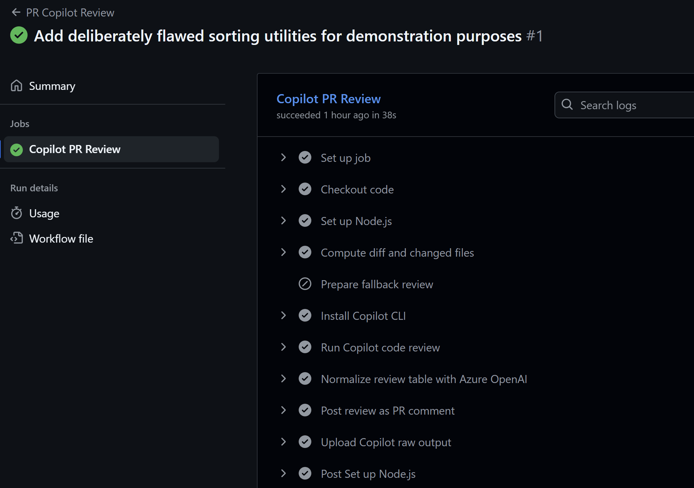

## GitHub Copilot Lab

### Why Integrate Copilot CLI?

Copilot CLI supports authentication with personal access tokens (PATs), which makes it easy to run inside CI/CD environments such as GitHub, GitLab, Jenkins, and Azure DevOps. Integrating the CLI lets you bring Copilot’s assistance into these pipelines and extend how you use Copilot beyond the editor.

### How We'll Use It in This Lab

In this lab we will:
- Integrate Copilot CLI into a GitHub Actions workflow so every new PR triggers an automated review.
- Use Azure OpenAI in the same workflow to summarize the Copilot CLI findings and post them back to the PR.
- Note: the example focuses on code review, but you can customize the workflow for other scenarios.

## Lab Environment

### Software Requirements
- **Node.js**: >= 22.0.0
- **npm**: >= 10.0.0
- **VS Code**: latest version
- **GitHub Copilot**: signed in

---

## Lab Steps

### Step 1: Create a PAT

#### 1.1 Goal
Generate a personal access token.

#### 1.2 Procedure

1. **Sign in to GitHub**
   Go to **Settings**.
   

2. **Create the PAT**
   Navigate to **Developer settings → Personal access tokens → Tokens (classic)**, click **Generate new token**, and store it securely.
   

#### 1.3 Validation
- The token is generated and saved locally.

### Step 2: Create GitHub Secrets

#### 2.1 Goal
Add secrets to the repository.

#### 2.2 Procedure

1. **Open the repository settings**
   On GitHub, open the target repository and go to **Settings**.

2. **Create secrets**
   Under **Secrets and variables → Actions**, click **New repository secret** and add the following (use the PAT from Step 1 for `COPILOT_CLI_PAT`):
   ```
   COPILOT_CLI_PAT
   AZURE_OPENAI_API_KEY
   AZURE_OPENAI_BASE_URL
   AZURE_OPENAI_MODEL
   ```
   

#### 2.3 Validation
- The secrets are created successfully.

### Step 3: Integrate Copilot CLI and Azure OpenAI in GitHub Actions

#### 3.1 Goal
Wire Copilot CLI and Azure OpenAI into the GitHub workflow.

#### 3.2 Procedure
1. **Open the local repo in VS Code**
   Make sure you are still on the `feature/testbranch` branch.

2. **Add the GitHub Actions workflow**
   Create `.github/workflows/pr-copilot-review.yml`. Use the example at <https://github.com/jacwu/github-materials/blob/main/.github/workflows/pr-copilot-review.yml> as a reference.

3. **Add the Azure OpenAI helper script**
   Create `scripts/normalize_review_result.py`. Use <https://github.com/jacwu/github-materials/blob/main/scripts/normalize_review_result.py> as a reference.

4. **Commit and push**
   Commit your changes locally and push them. This activates the earlier PR from Step 2 and triggers the new GitHub Actions workflow, which runs the Copilot review and posts the summarized results.

#### 3.3 Validation
- The **Actions** tab shows the workflow run.
  

- Within the run details, both **Run Copilot Code Review** and **Normalize Review Table with Azure OpenAI** succeed.
  

- The PR displays the review summary. Because this commit adds only YAML and Python scripts, the review might not flag issues; push problematic code to experiment further.
  