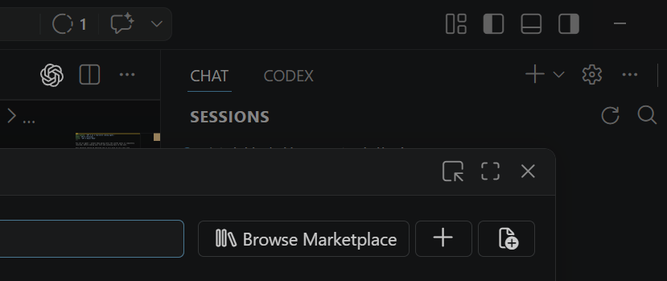
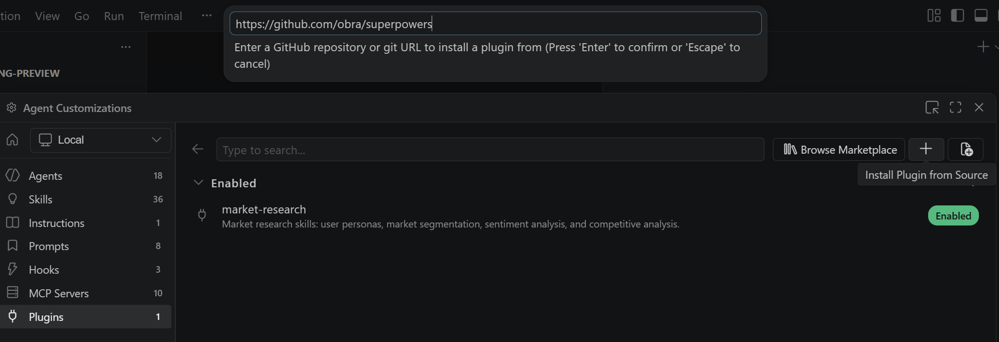
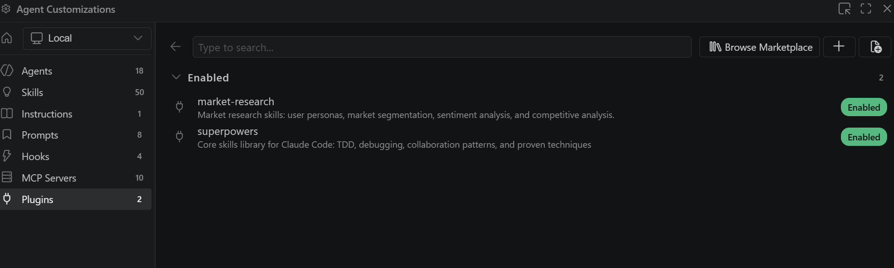

# GitHub Copilot Plugin 安装指南

Plugin（插件）是 GitHub Copilot 的扩展机制，允许你为 Copilot 添加额外的 Skills、Agents 和 Instructions，从而增强其在特定领域的能力。你可以通过 **VS Code** 或 **Copilot CLI** 两种方式安装 Plugin。

---

## 一、在 VS Code 中安装 Plugin

### 1.1 前置条件

- VS Code 最新版本
- GitHub Copilot 扩展已安装并登录

### 1.2 操作步骤

1. **打开 Agent Customizations 面板**

   在 VS Code 中，先打开右侧的 **GitHub Copilot 聊天窗口**，然后点击窗口顶部的 **齿轮按钮（⚙）**，即可进入 **Agent Customizations** 面板。

   

   在左侧导航中点击 **Plugins**。

2. **安装 Plugin**

   点击右上角的 **Install Plugin from Source** 按钮，在弹出的输入框中输入 GitHub 仓库地址，例如：

   ```
   https://github.com/obra/superpowers
   ```

   按 **Enter** 确认安装。

   

3. **确认安装成功**

   安装完成后，在 Plugins 列表中可以看到新安装的插件已显示为 **Enabled** 状态。同时 Skills 数量也会相应增加。

   

---

## 二、在 Copilot CLI 中安装 Plugin

### 2.1 安装 GitHub Copilot CLI

首先需要安装 GitHub Copilot CLI 命令行工具。

1. **安装 Copilot CLI**

   在终端中执行以下命令：

   ```bash
   npm install -g @github/copilot
   ```

2. **启动 Copilot CLI**

   安装完成后，在终端中输入 `copilot` 命令启动，并根据提示完成登录。

### 2.2 使用 Plugin Marketplace 安装 Plugin

Copilot CLI 提供了 `/plugin marketplace` 命令来管理插件。以安装 **superpowers** 插件为例：

1. **添加 Marketplace 源**

   将 `obra/superpowers-marketplace` 添加到本地 marketplace 列表：

   ```
   /plugin marketplace add obra/superpowers-marketplace
   ```

2. **查看已添加的 Marketplace**

   确认 marketplace 已成功添加：

   ```
   /plugin marketplace list
   ```

3. **浏览 Marketplace 中的可用插件**

   查看 `superpowers-marketplace` 中提供的插件列表：

   ```
   /plugin marketplace browse superpowers-marketplace
   ```

4. **安装插件**

   从 marketplace 中安装 superpowers 插件：

   ```
   /plugin install superpowers@superpowers-marketplace
   ```

5. **验证安装**

   使用 `/skills` 命令查看已加载的 Skills，确认 superpowers 插件的 Skills 已成功加载：

   ```
   /skills
   ```
